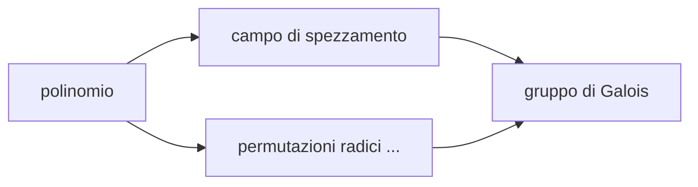

# {{ $frontmatter.title }} 

#### Il corso tratta la teoria delle equazioni algebriche.

::: tip DEF &emsp; Equazione algebrica
Con equazione algebrica si intende un'equazione nella forma $p(x) = 0$\
dove $p \in F[x]$ è un polinomio su qualche campo $F$
:::

## Origini
::: tip Nasce da 2 domande:
1. Siano $a_1, \dots , a_n \in \mathbb{Q}$,\
l'equazione $a_0 + a_1x + \dots + a_nx^n = 0$ ammette soluzione in $\mathbb{C}$?
2. Qualora la risposta a (1) fosse sì, esiste una formula[^1] che permetta di determinare tali soluzioni? 
:::

Vediamo l'evoluzione nel tempo della risposta a queste due domande:

| $\delta$ (grado) | domanda 1  | domanda 2 |                                  chi e quando                                   |
| :--------------- | :--------: | :-------: | :-----------------------------------------------------------------------------: |
| 1                |   ovvio    |   ovvio   |                                       ...                                       |
| 2                |     sì     |    sì     |                             Babilonesi (1770 a.C.)                              |
| 3                |     sì     |    sì     | Scipione del Ferro / Tartaglia (1500 d.C)   Pubblicata da Cardano (1545 d.C) |
| 4                |     sì     |    sì     |                               Ferrari (1545 d.C)                                |
| $\geq$ 5         | sì   sì | -   no |                       Gauss (1799 d.C)   Abel-Ruffini                        |

## Teoria di Galois

Dà condizioni necessarie e sufficienti affinché un'equazione algebrica sia **risolubile per radicali**[^2].

::: warning Idea
A ogni polinomio $p \in F[x]$ associamo un gruppo ( detto gruppo di Galois ) e\
l'equazione $p(x) = 0$ è risolubile per radicali $\iff$ il suo gruppo di Galois è risolubile
:::

In una prima formulazione possiamo vedere il gruppo di Galois come **gruppo delle permutazioni delle radici** del polinomio che **preservano le relazioni** tra queste ( l'operazione di gruppo è la composizione ).

::: tip <t></t> 
Quindi se $p$ ha grado $n$, $Gal(p)$ è isomorfo a un sottogruppo di $S_n$
:::

::: details Relazione 
Una relazione tra $x_1, \dots , x_n \in F$ non è altro che un'equazione del tipo $Q(x_1, \dots , x_n) = 0$ &emsp; con &emsp; $Q \in F[x_1, \dots , x_n]$ 
:::

::: warning Visione più moderna
Al polinomio $p \in F[x]$ associamo $K$ campo di spezzamento di $p$ su $F$ e possiamo vedere il gruppo di Galois del polinomio come come gruppo degli automorfismi di $K$ che preservano $F$
:::

::: tip <t></t>
Quindi è conveniente definire: &emsp; $Gal(p) \coloneqq Gal(K/F) \coloneqq Aut(K/F)$\
dove $Aut(K/F) \coloneqq \{\phi \in Aut(K) : \phi(f) = f \quad \forall f \in F\}$
:::

[^1]: con formula si intende una sequenza finita di operazioni aritmetiche e estrazioni di radici
[^2]: cioè è possibile calcolare tutte le soluzioni usando una formula come in **1.**
